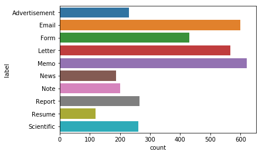

# Classification des documents du procès des groupes américains du tabac

Le but de ce projet est de classifier des documents issus du procès des groupes américains. Ce projet contient donc 3482 documents dont les classes sont les suivantes :

* Advertisement
* Email
* Form
* Letter
* Memo
* News
* Note
* Report
* Resume
* Scientific

Les classes du dataset sont réparties comme suit: 

## Dataset : 

Le dataset est composé de 10 dossiers, chacun correspondant à une classe donnée et comprend ses OCR (Optical Character Recognition). Nous séparons notre dataset en 3 jeux de données :
* Le training set : qui comprend 2228 données
* Le test set : qui comprend 697 données
* Le dev set : qui comprend 557 données

## Feature Engineering:

Cette étape consiste à transformer les données en vecteurs. Pour ce faire, on précède comme suit:

1. On utilise le Count Vectorizer Object : où l'output serait une forme matricielle contenant les occurences de chaque mot pour chaque document
2. On représente les données en TF-IDF : une représentation normalisée prenant en compte le TF (Term Frequency) et l'IDF (Inverse Document Frequency). Cette phase a été implémentée sur 3 échelles: 
    * Word Level TF-IDF
    * Character Level TF-IDF
    * N-gram Level TF-IDF
    
Le but étant de comparer les résultats de la classification de chacune de ces représentations.

## Linear Model Classifier 

Pour ce modèle, on obtient une précision maximale pour la représentation en Count Vectorizer de *0.79*

* LR, Count Vectors:  0.79
* LR, WordLevel TF-IDF:  0.77
* LR, N-Gram Vectors:  0.72
* LR, CharLevel Vectors:  0.78

## Naive Bayes
Pour ce modèle, la précision est maximale pour la représentation en n-gram *0.71*

* NB, Count Vectors:  0.66
* NB, WordLevel TF-IDF:  0.65
* NB, N-Gram Vectors:  0.71
* NB, CharLevel Vectors:  0.57

## MLP Classifier

